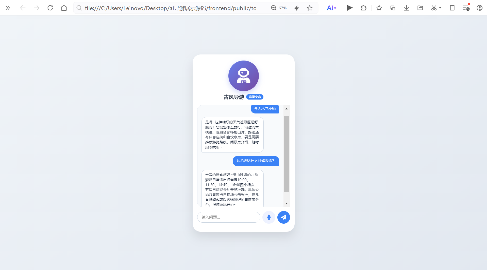
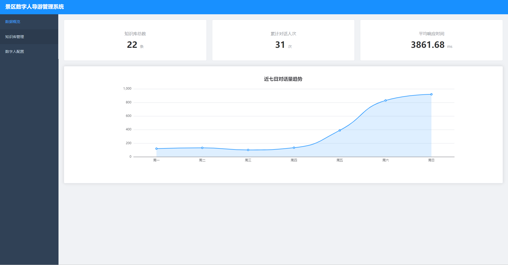
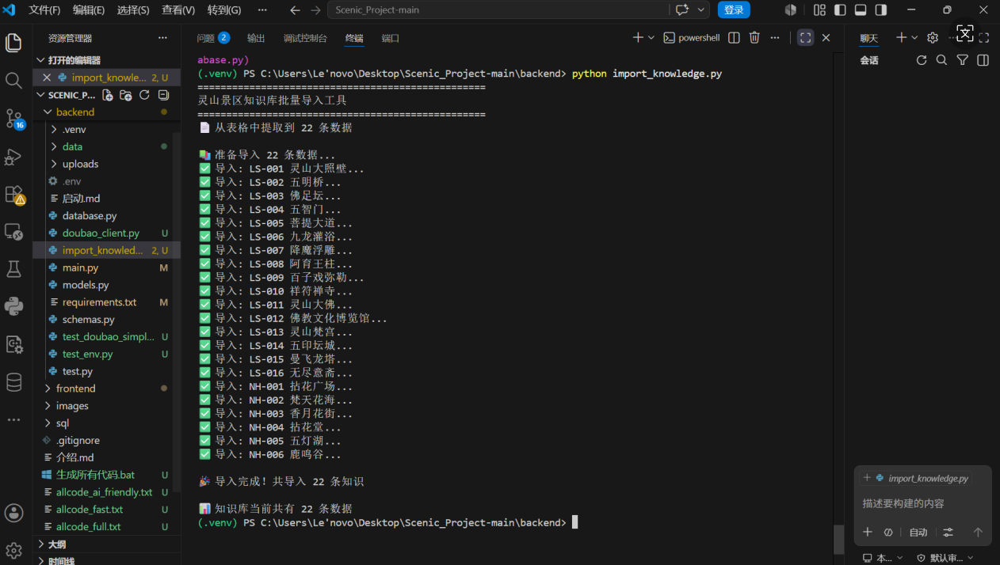
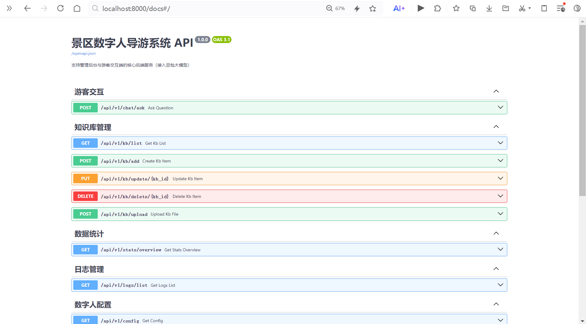
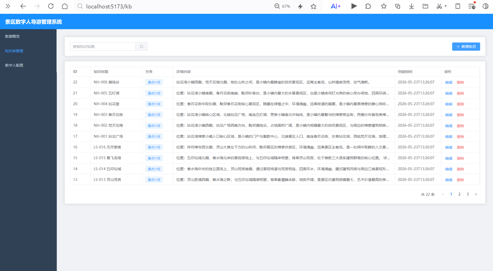

```markdown
# 🏞️ 景区数字人导游系统

基于火山方舟豆包大模型开发的智能景区导游系统，为游客提供7×24小时智能问答服务，同时为景区管理者提供知识库管理、数据统计等功能。

## ✨ 核心功能

### 游客端
- 🤖 **豆包大模型驱动**：接入火山方舟豆包 API，自然语言理解，流畅对话
- 📚 **RAG 检索增强**：结合知识库精准回答景点问题
- 🎤 **语音输入**：支持浏览器语音识别，解放双手（最好用chrome浏览器验证语音功能）
- 📱 **移动端适配**：H5 页面，无需安装 App



### 管理端
- 📊 **数据看板**：知识库统计、对话统计、响应时间监控、趋势图表
- 📝 **知识库管理**：景点知识增删改查、搜索过滤、分页展示
- 🎨 **数字人配置**：形象风格（古风/现代/卡通）、音色（女声/男声/童声）、开场白自定义



## 🛠️ 技术栈

| 层级 | 技术 |
|------|------|
| 后端框架 | FastAPI |
| ORM | SQLAlchemy |
| 数据库 | MySQL |
| AI 模型 | 豆包 (火山方舟) |
| 前端框架 | Vue3 + Vite |
| UI 组件 | Element Plus |
| 游客端 | HTML5 + 语音识别 API |

## 🚀 快速启动

### 环境要求
- Python 3.9+
- MySQL 8.0+
- Node.js 16+（可选，用于管理后台）

### 启动步骤

```bash
# 1. 创建数据库
mysql -u root -p -e "CREATE DATABASE scenic_digital_human"

# 2. 安装后端依赖
cd backend
pip install -r requirements.txt

# 可选：安装文档解析库
pip install python-docx

# 启动后端
python main.py
```



```bash
# 3. （可选）启动管理后台
cd frontend
npm install
npm run dev
```

### 访问地址

| 服务 | 地址 | 说明 |
|------|------|------|
| 后端 API | http://localhost:8000 | FastAPI 服务 |
| Swagger 文档 | http://localhost:8000/docs | API 在线调试 |
| 管理后台 | http://localhost:5173 | Vue3 管理端 |
| 游客端 | 用 VS Code Live Server 打开 `frontend/public/tourist.html` | 移动端 H5 |

## 📁 项目结构

```
├── backend/                 # 后端服务
│   ├── main.py              # FastAPI 主入口
│   ├── database.py          # 数据库连接
│   ├── models.py            # SQLAlchemy 模型
│   ├── schemas.py           # Pydantic 模型
│   ├── doubao_client.py     # 豆包 API 客户端
│   ├── requirements.txt     # Python 依赖
│   └── data/                # 知识库数据文件
├── frontend/                # 前端管理后台
│   ├── src/                 # Vue3 源码
│   └── public/
│       └── tourist.html     # 游客端 H5 页面
└── sql/
    └── init.sql             # 数据库初始化脚本
```

## 📡 API 接口

| 方法 | 路径 | 功能 |
|------|------|------|
| POST | `/api/v1/chat/ask` | 游客问答 |
| GET | `/api/v1/kb/list` | 知识库列表 |
| POST | `/api/v1/kb/add` | 新增知识 |
| PUT | `/api/v1/kb/update/{id}` | 更新知识 |
| DELETE | `/api/v1/kb/delete/{id}` | 删除知识 |
| GET | `/api/v1/stats/overview` | 统计数据 |
| GET | `/api/v1/logs/list` | 日志列表 |
| GET | `/api/v1/config` | 获取配置 |
| POST | `/api/v1/config` | 更新配置 |
| GET | `/api/v1/health` | 健康检查 |



## 📊 知识库数据

已导入 22 条核心景点数据：

- 灵山大照壁、五明桥、佛足坛、五智门、菩提大道
- 九龙灌浴、降魔浮雕、阿育王柱、百子戏弥勒、祥符禅寺
- 灵山大佛、佛教文化博览馆、灵山梵宫、五印坛城、曼飞龙塔、无尽意斋
- 拈花广场、梵天花海、香月花街、拈花堂、五灯湖、鹿鸣谷



## 🔧 配置说明

在 `backend/.env` 中配置豆包 API：

```env
DOUBAO_API_KEY=你的API密钥
DOUBAO_ENDPOINT_ID=你的接入点ID
DOUBAO_BASE_URL=https://ark.cn-beijing.volces.com/api/v3

# TTS 旧版控制台配置（用于语音合成，需要开通服务，可不选）
VOLC_TTS_APP_ID=你的APPID
VOLC_TTS_ACCESS_TOKEN=你的语音合成服务的TOKEN
```


## 未来改进方向

### 安全加固
- API 认证与授权：引入 JWT 或 OAuth2，区分游客端和管理端权限
- SQL 注入防护：当前已使用 SQLAlchemy ORM 防止注入，可进一步添加输入校验
- XSS 防护：对用户输入进行严格的过滤和转义
- API 限流：防止恶意刷接口，保障服务稳定
- HTTPS 部署：生产环境启用 HTTPS，加密传输数据
- 敏感信息保护：将 API Key 等敏感配置存入密钥管理服务（如 Vault）

### 性能优化
- Redis 缓存：缓存热点问题答案，减少大模型调用
- 数据库索引优化：为高频查询字段添加索引
- 异步处理：将耗时的知识库导入、日志写入改为异步任务
- CDN 加速：前端静态资源部署至 CDN

### 功能扩展
- 多景区支持：支持切换不同景区的知识库
- 多语言国际化：支持英文、日文等多语言问答
- 游客画像分析：基于对话数据生成用户画像
- 智能推荐：根据游客兴趣推荐个性化游览路线
- 图片识别问答：支持拍照识别景点并自动介绍
- 语音合成升级：接入火山方舟 TTS 付费版，实现更自然的语音播报

### 可观测性
- 日志聚合：接入 ELK 或 Loki 实现日志集中管理
- 链路追踪：使用 Jaeger 或 SkyWalking 追踪请求全链路
- 监控告警：接入 Prometheus + Grafana，设置关键指标告警

---

## 📄 许可证
MIT License
```